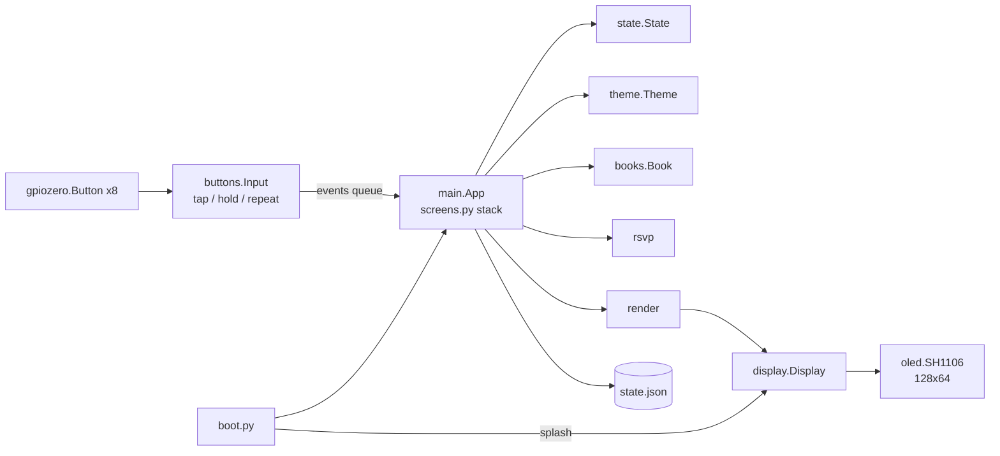

# Rapid Reader

RSVP (Rapid Serial Visual Presentation) speed-reading appliance built on
a Raspberry Pi Zero W v1.1 and a **1.3" 128×64 monochrome SH1106 OLED
HAT** with a 5-way joystick and 3 buttons.

Words are flashed one at a time at a fixed point on the OLED. The
Optimal Recognition Point (ORP) letter is drawn at a fixed pivot (style
depends on the active theme), so your eyes never move. Themes pick
sans / serif / mono faces from DejaVu. Reading position, speed, and
settings are saved per book automatically.

## Features

- Library of `.txt` / `.epub` books; open resumes last position
- RSVP playback with ORP pivot; WPM adjust; sentence and chapter jump
- Bookmarks, chapters list, book info; auto-save every
  `SAVE_EVERY_WORDS` words and on pause / leave / SIGTERM
- Themes, word size, pivot style; session-only contrast nudge
- Idle dim then sleep outside Reading (wake swallows the first key)
- Power-cut resume via `in_book` in `state.json`
- Power off / reboot from Library (K1 hold) or System menu

## Documentation

| Doc | Role |
|-----|------|
| [CONTROLS.md](CONTROLS.md) | Full key reference, menus, settings, themes |
| [datasheets/README.md](datasheets/README.md) | Hardware pinouts and datasheet index |
| [docs/README.md](docs/README.md) | Index — living docs vs historical plan briefs |

## Repository layout

| Path | Purpose |
|------|---------|
| `rapid_reader/` | The application (Python 3: stdlib + Pillow + spidev + lgpio + gpiozero) |
| `rapid_reader/boot.py` | Service entry point: opens the OLED, pushes the pre-rendered splash, then imports and runs `main` |
| `rapid_reader/main.py` | App loop, event dispatch, idle dim/off, power/reboot |
| `rapid_reader/screens.py` | Screen-stack navigation (library, reading, paused, lists, settings, …) |
| `rapid_reader/display.py` | `Display` wrapping the OLED; splash loading; retrying `open_display()` |
| `rapid_reader/oled.py` | Minimal SH1106 driver over `spidev` + `lgpio`; 1-bit page writes |
| `rapid_reader/render.py` | Every screen as a PIL image (drawing only, no hardware) |
| `rapid_reader/theme.py` | Theme presets (palette, font face, pivot style) |
| `rapid_reader/state.py` | Persistent `state.json` (settings, per-book position/bookmarks) |
| `rapid_reader/contracts.py` | Shared `Theme` / `Screen` interfaces, control map, state v2 schema |
| `rapid_reader/rsvp.py` | ORP + per-word timing (pure functions) |
| `rapid_reader/books.py` | Library scan, `.txt`/`.epub` loading, tokenizer, chapter heuristics |
| `rapid_reader/buttons.py` | Tap / hold / repeat detection on top of `gpiozero.Button` |
| `rapid_reader/config.py` | Pins, SPI, OLED size, contrast, paths, timing constants |
| `system/rapid-reader.service` | systemd unit installed on the device |
| `tools/build_card.sh` | Builds a bootable SD card offline (flash, grow, chroot apt, deploy) |
| `tools/salvage_card.sh` | Copies wifi/user/books off an old card before it is wiped |
| `tools/make_splash.py` | Pre-renders the boot splash (`splash.bin`) for the OLED |
| `tools/pdf_to_txt.py` | Internet Archive–style PDF → cleaned `.txt` via `pdftotext` |
| `tools/flash_ssh_wifi.sh` | Temporary SSH/wifi bring-up flash (stock image only; does **not** install the app) |
| `datasheets/` | Datasheets for the Pi Zero W and the OLED HAT (see its README) |
| `docs/` | Historical SH1106 overhaul phase briefs (see [docs/README.md](docs/README.md)) |
| `ebooks/` | Sample library (public-domain Gutenberg texts + a welcome tutorial) |
| `tests/` | Hardware-free regression tests (`pytest`) |
| `sdcard_build/` | Raspberry Pi OS Lite image used to build cards (not committed) |

## Hardware

| Function | Detail |
|----------|--------|
| OLED | 1.3" 128×64 monochrome SH1106 |
| SPI bus | SPI0 CE0 (`/dev/spidev0.0`; CE0 is kernel-managed — no app CS GPIO) |
| MOSI / SCLK | BCM 10 / BCM 11 |
| DC / RST | BCM 24 / BCM 25 |
| Contrast | Software/register (`0x81`); no backlight |

| Input | BCM pin |
|-------|---------|
| Joystick UP | 13 |
| Joystick DOWN | 19 |
| Joystick LEFT | 5 |
| Joystick RIGHT | 26 |
| Joystick PRESS | 6 |
| K1 | 16 |
| K2 | 20 |
| K3 | 21 |

All eight inputs are active-low with pull-ups (`config.PINS`). The build
script enables `dtparam=spi=on` and sets early GPIO pull-ups; there is no
second SPI bus. Pinout and controller details are in
[datasheets/README.md](datasheets/README.md).

## Architecture



- **One OLED, screen stack.** `screens.py` owns a navigation stack
  (library, reading, paused, lists, settings, …). `main.App` dispatches
  input events to the top screen and redraws a single 128×64 frame each
  tick.
- **Idle dim / off.** Outside READING, no input for `IDLE_DIM_SECS`
  drops contrast to `IDLE_DIM_CONTRAST`; after `IDLE_OFF_SECS` the panel
  sleeps. Any key wakes the display and is swallowed (not passed to the
  active screen). See `_tick_idle` in `main.py`.
- **Event model.** Button callbacks (gpiozero threads) only enqueue
  `(name, kind)` tuples — e.g. `("k1", "tap")`, `("up", "repeat")`.
  Names are the keys of `config.PINS`. The main thread consumes them;
  while READING it polls between words so a tap is handled within one
  frame.
- **Playback.** `step_word()` computes each word's delay with
  `rsvp.word_delay()` (long words and clause/sentence/paragraph ends
  linger), renders the frame, measures how long the panel took and
  sleeps the remainder. A full SH1106 frame is ~1 KiB and pushes in a
  few milliseconds at 4 MHz.
- **Boot.** The unit starts `boot.py` with `DefaultDependencies=no`
  right after local filesystems are up. It opens the OLED (retrying
  while `/dev/spidev*` / the GPIO chip are still appearing), blits a
  pre-rendered splash before Pillow is even imported, then loads the
  app. On SIGTERM the app saves state and puts the panel to sleep.
- **Persistence.** `state.State` writes `state.json` atomically (tmp +
  rename) on settings changes, every `SAVE_EVERY_WORDS` words, on
  pause/library return and on SIGTERM. `in_book` lets a power-cut
  mid-book resume paused at the same word on the next boot.
- **Hardware injection.** `App(display=..., input_cls=...)` accepts any
  object with the display / input contracts; tests drive the whole stack
  with no SPI/GPIO present.
- **Chapter detection** is best-effort: real `<h1>`–`<h6>` tags in
  EPUBs, or (plain text only) a short standalone paragraph like
  `CHAPTER I.`, `Letter 1`, `XIV` or `I. A SCANDAL IN BOHEMIA`.

## Controls (summary)

Eight inputs: 5-way joystick + K1 / K2 / K3. Gestures are **tap**,
**hold**, and **repeat** (see [CONTROLS.md](CONTROLS.md)). Stable roles:
**K1** = back/leave, **K2** = menu, **K3** = act (pause, confirm-yes,
list context).

| Mode | Highlights |
|------|------------|
| Library | up/down select, left/right page, press open; K1 hold power-off; K2 main menu; K3 book info |
| Reading | press/K3 pause; up/down wpm; left/right sentence; K1 → library; K2 book menu |
| Paused | same as Reading, plus left/right hold = chapter jump |
| Lists | press select; K1 back; K2 menu; K3 context action when available |
| Confirm | K3 yes; K1 no |
| Idle | dim then sleep; any key wakes (swallowed) |

Menus, settings, themes, display contrast, and System rows are fully
listed in [CONTROLS.md](CONTROLS.md).

## Settings & themes

Defaults: theme `night`, pivot `ticks`, word size `medium`, 250 wpm.
Five presets (`night`, `paper`, `focus`, `dim`, `mono`) pick invert,
DejaVu face, default pivot style, and contrast. Word size and pivot
style cycle in Settings; Display contrast is session-only (not in
`state.json`). See CONTROLS for the full tables.

## Adding books

Drop `.txt` or `.epub` files into `/home/reader/ebooks`:

```sh
scp "My Book.epub" reader@rapidreader.local:ebooks/
```

Then rescan from the library (or just reboot).

### Internet Archive PDFs

Put digitized PDFs in `to_convert/` (gitignored), then convert with
`pdftotext` (poppler) and a small cleanup script:

```sh
python3 tools/pdf_to_txt.py                  # to_convert/*.pdf → ebooks/
python3 tools/pdf_to_txt.py book.pdf --out ebooks/
```

Copy the resulting `.txt` to the device as above.

## Development & tests

The app is a flat module tree under `rapid_reader/` (not an installable
package). Imports are top-level (`import config`, not
`rapid_reader.config`); `boot.py`, `main.py`, and `tests/conftest.py`
put `rapid_reader/` on `sys.path`.

Runtime knobs are **Python constants** in `config.py` (pins, paths,
WPM, idle, font dirs, settings defaults). There is no app CLI and no
env-based config — edit `/opt/rapid-reader/config.py` on the device and
`sudo systemctl restart rapid-reader`. State v2 schema is documented at
the top of [`rapid_reader/contracts.py`](rapid_reader/contracts.py).

Tests run anywhere with Python 3 + Pillow + pytest; no Pi, SPI or GPIO
is needed. DejaVu Sans / Serif / SansMono must be installed
(`fonts-dejavu-core` on Debian — serif and mono faces are included or
pulled in as a dependency; `ttf-dejavu` on Arch; see `FONT_DIRS` /
`FONT_FACES` in `config.py`). Themes use the serif and mono faces for
some presets.

```sh
python3 -m pytest -q
```

Coverage:

- `test_rsvp.py` — ORP index rules, core-span stripping, delay weights.
- `test_books.py` — tokenizer, heading heuristics and their false
  positives, synthetic EPUB extraction, library scan, every bundled book
  loads.
- `test_buttons.py` — tap / hold / repeat timing, gpiozero construction
  parameters.
- `test_oled.py` — SH1106 init / page writes, column offset, contrast,
  sleep, `SpiIO` against stub `spidev`/`lgpio`.
- `test_display.py` — frame routing, splash round-trip, missing /
  wrong-size splash, the `open_display` retry loop.
- `test_render.py` — every frame is 128×64; pivot placement; word
  overflow; list highlight/scroll; theme faces.
- `test_state.py` — state v2 load/save, migration from v1, defaults.
- `test_app.py` — screen-stack navigation, reading/paused bindings,
  idle dim/off/wake, speed changes, sentence/chapter jumps, periodic
  saves, end-of-book, resume after power-cut, power-off confirm,
  SIGTERM and error screens.

To preview the screens without hardware, call the `render` functions
and `.save()` the returned images (see `tests/test_render.py`).
Regenerate the boot splash with `python3 tools/make_splash.py`.

## Building a card

```sh
# optional: keep wifi / password / ssh key / books from the old card
sudo tools/salvage_card.sh /dev/sdX /root/rr-salvage
# flash + configure a new card (wipes /dev/sdX!)
sudo tools/build_card.sh /dev/sdX /root/rr-salvage
```

`build_card.sh` needs `sdcard_build/raspios_lite_armhf_latest.img.xz`
(Raspberry Pi OS Lite 32-bit, Trixie) and `qemu-arm-static` with
binfmt_misc. It flashes the image, grows the root partition to fill the
card, enables SPI0 and GPIO pull-ups and disables Bluetooth/HDMI/audio/
camera in `config.txt`, quiets the kernel command line, installs
`python3-pil fonts-dejavu-core` (spidev, lgpio and gpiozero ship with
the image) in a qemu chroot, renames the placeholder user to `reader`
(groups `spi gpio`), restores wifi profiles, deploys `/opt/rapid-reader`
with the splash, copies the sample library, enables ssh and the service,
and finally imports every module under the target's Python as a smoke
test. No first-boot wizard runs: the first boot goes straight to the
splash and then the library.

## Device layout

- App: `/opt/rapid-reader` (`boot.py`, runs as the `rapid-reader`
  systemd service as user `reader`, groups `spi gpio`)
- Splash: `/opt/rapid-reader/splash/`
- Books: `/home/reader/ebooks`
- State (positions, settings, bookmarks): `/var/lib/rapid-reader/state.json`
- Logs: `journalctl -u rapid-reader` (persistent journal, 32 MB cap)

## Notes & troubleshooting

- **Boot.** The splash appears as soon as the kernel has brought up SPI
  (a few seconds after power-on on a Zero W); the library follows once
  Python and Pillow are loaded. Power-off is via `K1 hold` from the
  library (confirm on the next screen); wait for the panel to go dark
  before unplugging.
- **Orientation.** Default is `ROTATE_180 = True` (thumbpad on the left).
  If the image is upside down for your mounting, flip the flag in
  `/opt/rapid-reader/config.py` (also swaps joystick directions to
  match), then `sudo systemctl restart rapid-reader`.
- **Contrast.** `IDLE_ACTIVE_CONTRAST` / `IDLE_DIM_CONTRAST` in
  `config.py` (SH1106 contrast register; no backlight PWM).
- **SPI.** `spidev.bufsiz=65536` stays on the kernel command line
  (harmless for the OLED's small transfers).
- **SSH**: `ssh reader@rapidreader.local` (wifi is 2.4 GHz only on the
  Zero W). The build script prints a warning if it had to fall back to
  the default password `reader`; change it with `passwd`.
