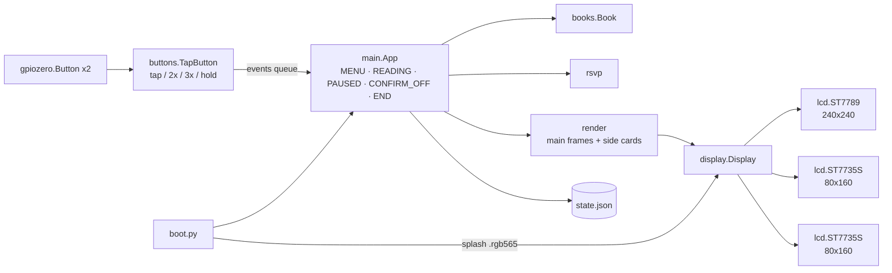

# Rapid Reader

RSVP (Rapid Serial Visual Presentation) speed-reading appliance built on
a Raspberry Pi Zero W v1.1 and the Waveshare **Zero LCD HAT (A)**: one
1.3" 240×240 IPS panel flanked by two 0.96" 160×80 panels, plus two keys.

Words are flashed one at a time at a fixed point on the centre screen.
The Optimal Recognition Point (ORP) letter is drawn in accent colour at
a fixed pivot with tick marks above and below, so your eyes never move.
The small side screens carry only peripheral, slowly-changing
information (progress, speed, key hints) and are dimmed while reading.
Everything is dark-themed. Reading position and speed are saved per
book automatically.

## Repository layout

| Path | Purpose |
|------|---------|
| `rapid_reader/` | The application (Python 3: stdlib + Pillow + spidev + lgpio + gpiozero) |
| `rapid_reader/boot.py` | Service entry point: opens the panels, pushes the pre-rendered splash, then imports and runs `main` |
| `rapid_reader/main.py` | State machine, playback loop, event handling, side-screen orchestration |
| `rapid_reader/display.py` | `Display` = the three panels as one object; splash loading; retrying `open_display()` |
| `rapid_reader/lcd.py` | Minimal ST7789 (1.3") / ST7735S (0.96") drivers over `spidev` + `lgpio`; RGB565 packing |
| `rapid_reader/render.py` | Every screen as a PIL image (drawing only, no hardware) |
| `rapid_reader/rsvp.py` | ORP + per-word timing (pure functions) |
| `rapid_reader/books.py` | Library scan, `.txt`/`.epub` loading, tokenizer, chapter heuristics |
| `rapid_reader/buttons.py` | Tap / multi-tap / hold detection on top of `gpiozero.Button` |
| `rapid_reader/config.py` | Pins, SPI buses, panel sizes, backlight levels, paths, timing constants |
| `system/rapid-reader.service` | systemd unit installed on the device |
| `tools/build_card.sh` | Builds a bootable SD card offline (flash, grow, chroot apt, deploy) |
| `tools/salvage_card.sh` | Copies wifi/user/books off an old card before it is wiped |
| `tools/make_splash.py` | Pre-renders the boot splash as raw RGB565 frames |
| `datasheets/` | Datasheets & schematics for the Pi Zero W and the LCD HAT (see its README) |
| `ebooks/` | Sample library (public-domain Gutenberg texts + a welcome tutorial) |
| `tests/` | Hardware-free regression tests (`pytest`) |
| `sdcard_build/` | Raspberry Pi OS Lite image used to build cards (not committed) |

See [CONTROLS.md](CONTROLS.md) for the full key reference.

## Hardware

| Panel | Size | Controller | SPI | CS | DC | RST | BL |
|-------|------|-----------|-----|----|----|-----|----|
| centre (main) | 1.3" 240×240 | ST7789VW | SPI1 CE0 | BCM 18 | 22 | 27 | 19 |
| left  | 0.96" 80×160 (portrait) | ST7735S | SPI0 CE0 | BCM 8 | 4 | 24 | 13 |
| right | 0.96" 80×160 (portrait) | ST7735S | SPI0 CE1 | BCM 7 | 5 | 23 | 12 |

Keys: K1 = BCM 25 (upper), K2 = BCM 26 (lower), active low. The main
panel needs `dtoverlay=spi1-1cs`; all of this is set by the build
script. Backlights are driven with `lgpio` PWM so the sides can be
dimmed independently of the centre. Pinout and controller details are
in [datasheets/README.md](datasheets/README.md).

## Architecture



- **Three screens, one process.** `Display.show(main=, left=, right=)`
  pushes whichever frames are given. The app only redraws a side card
  when its *content key* changes (`_side(which, key, factory)`), so
  during reading the left card updates once per percent / minute and
  the right card only on a speed change — the SPI bus is otherwise
  free for the word frames.
- **Side-screen roles.** Library: left = card for the highlighted book,
  right = key hints. Reading: left = progress bar, % and time remaining,
  chapter; right = large wpm with the speed-change hint; both dimmed to
  `BL_SIDE_READING`. Paused / confirm / end: progress or blank on the
  left, context-sensitive key hints on the right, normal brightness.
- **Event model.** Button callbacks (gpiozero threads) only enqueue
  `(kind, n)` tuples: `("A", 2)` is a double-tap on K1, `("holdB", 0)` a
  hold on K2. The main thread consumes them; while READING it polls with
  `get_nowait()` between words, so a tap is handled within one frame.
- **Playback.** `step_word()` computes each word's delay with
  `rsvp.word_delay()` (long words and clause/sentence/paragraph ends
  linger), renders the frame, measures how long the panel took and
  sleeps the remainder. A 240×240 frame renders and packs in ~1 ms on
  a desktop and pushes in ~4 ms at 31 MHz, so on a Zero one word per
  frame holds well past `MAX_WPM`; if a frame ever *is* slower than the
  word delay, several words are pulled into one frame so the average
  pace still matches.
- **Boot.** The unit starts `boot.py` with `DefaultDependencies=no`
  right after local filesystems are up. It opens the panels (retrying
  while `/dev/spidev*` / the GPIO chip are still appearing), blits three
  pre-rendered `.rgb565` splash files before Pillow is even imported,
  then loads the app. On SIGTERM the app saves state and puts the panels
  to sleep with backlights off.
- **Persistence.** `State` writes `state.json` atomically (tmp + rename)
  on every wpm change, every `SAVE_EVERY_WORDS` words, on pause/menu and
  on SIGTERM. `in_book` lets a power-cut mid-book resume paused at the
  same word on the next boot. Per-book word totals are stored too so the
  library card can show length/position without loading the book.
- **Hardware injection.** `App(display=..., button_cls=...)` accepts any
  object with `show/backlight/sleep` and any factory with the
  `TapButton(pin, on_taps, on_hold)` signature; `lcd.ST77xx` takes any
  I/O object with `command/data/reset_pulse/backlight`. That is how the
  tests drive the whole stack with no SPI/GPIO present.
- **Chapter detection** is best-effort: real `<h1>`–`<h6>` tags in
  EPUBs, or (plain text only) a short standalone paragraph like
  `CHAPTER I.`, `Letter 1`, `XIV` or `I. A SCANDAL IN BOHEMIA`.

## Controls (summary)

K1 = upper key (forward: open / play / faster / next), K2 = lower key
(back: down / previous / slower / leave). The right screen always shows
the current bindings.

| Mode | K1 tap | K1 ×2 | K1 ×3 | K2 tap | K2 ×2 | K2 hold |
|------|--------|-------|-------|--------|-------|---------|
| Library | open book | rescan | — | down | up | power-off prompt |
| Reading | pause | +25 wpm | sentence → | ← sentence | −25 wpm | save & library |
| Paused | play | chapter → | sentence → | ← sentence | ← chapter | save & library |
| Confirm off | power off | | | cancel | | |

## Adding books

Drop `.txt` or `.epub` files into `/home/reader/ebooks`:

```sh
scp "My Book.epub" reader@rapidreader.local:ebooks/
```

Then double-tap K1 in the library (or just reboot).

## Development & tests

Tests run anywhere with Python 3 + Pillow + pytest; no Pi, SPI or GPIO
is needed. DejaVu Sans must be installed (`fonts-dejavu-core` on Debian,
`ttf-dejavu` on Arch; see `FONT_DIRS` in `config.py`).

```sh
python3 -m pytest -q
```

Coverage:

- `test_rsvp.py` — ORP index rules, core-span stripping, delay weights.
- `test_books.py` — tokenizer, heading heuristics and their false
  positives, synthetic EPUB extraction, library scan, every bundled book
  loads.
- `test_buttons.py` — tap counting, tap-window separation, hold
  suppressing taps, gpiozero construction parameters.
- `test_lcd.py` — RGB565 packing (byte order, primaries), ST7789 /
  ST7735S init sequences (MADCTL orientation, blank frame before
  display-on), 180° flip, window offsets, partial writes, size checks,
  backlight/sleep, `SpiIO` against stub `spidev`/`lgpio`.
- `test_display.py` — frame routing, `SWAP_SIDES`, splash file
  round-trip via `make_splash`, missing / wrong-size splash, the
  `open_display` retry loop (transient `lgpio` errors, deadline,
  non-retryable errors).
- `test_render.py` — every frame is panel-sized RGB and dark; the pivot
  letter's guide ticks land exactly on `PIVOT_X`; over-long words shrink
  or hyphenate rather than clip; menu highlight/scroll; paused-sentence
  overflow stays inside the frame; side cards; hint layout.
- `test_app.py` — the state machine end to end with three fake panels:
  three-screen menu, navigation frame counts, side-card redraw only on
  content change, backlight dimming in READING, speed-card refresh on
  wpm change, sentence/chapter jumps, chunking, periodic saves,
  end-of-book, resume after power-cut, power-off confirm / cancel /
  failure, key → queue plumbing, SIGTERM and error screens.

To preview the screens without hardware, call the `render` functions
and `.save()` the returned images (see `tests/test_render.py`).

## Building a card

```sh
# optional: keep wifi / password / ssh key / books from the old card
sudo tools/salvage_card.sh /dev/sdX /root/rr-salvage
# flash + configure a new card (wipes /dev/sdX!)
sudo tools/build_card.sh /dev/sdX /root/rr-salvage
```

`build_card.sh` needs `sdcard_build/raspios_lite_armhf_latest.img.xz`
(Raspberry Pi OS Lite 32-bit, Trixie) and `qemu-arm-static` with
binfmt_misc. It flashes the image, grows the root partition to fill the
card, enables SPI0/SPI1 and disables Bluetooth/HDMI/audio/camera in
`config.txt`, quiets the kernel command line, installs `python3-pil
fonts-dejavu-core` (spidev, lgpio and gpiozero ship with the image) in
a qemu chroot, renames the placeholder user to `reader` (groups `spi
gpio`), restores wifi profiles, deploys `/opt/rapid-reader` with the
splash, copies the sample library, enables ssh and the service, and
finally imports every module under the target's Python as a smoke test.
No first-boot wizard runs: the first boot goes straight to the splash
and then the library.

## Device layout

- App: `/opt/rapid-reader` (`boot.py`, runs as the `rapid-reader`
  systemd service as user `reader`, groups `spi gpio`)
- Splash frames: `/opt/rapid-reader/splash/{main,left,right}.rgb565`
- Books: `/home/reader/ebooks`
- State (positions, wpm, totals): `/var/lib/rapid-reader/state.json`
- Logs: `journalctl -u rapid-reader` (persistent journal, 32 MB cap)

## Notes & troubleshooting

- **Boot.** The splash appears as soon as the kernel has brought up SPI
  (a few seconds after power-on on a Zero W); the library follows once
  Python and Pillow are loaded. Power-off is via `K2 hold` → `K1` in the
  library; wait for all three screens to go dark before unplugging.
- **Orientation.** If the centre image is upside down set
  `MAIN_ROTATE_180 = True`; for the sides `SIDE_ROTATE_180 = True`; if
  the left and right cards are swapped set `SWAP_SIDES = True` — all in
  `/opt/rapid-reader/config.py`, then `sudo systemctl restart rapid-reader`.
- **Brightness.** `BL_MAIN`, `BL_SIDE`, `BL_SIDE_READING` (0–1) in
  `config.py`.
- **SPI throughput.** `spidev.bufsiz=65536` is on the kernel command
  line so a full 115 kB frame goes out in two transfers.
- **SSH**: `ssh reader@rapidreader.local` (wifi is 2.4 GHz only on the
  Zero W). The build script prints a warning if it had to fall back to
  the default password `reader`; change it with `passwd`.
