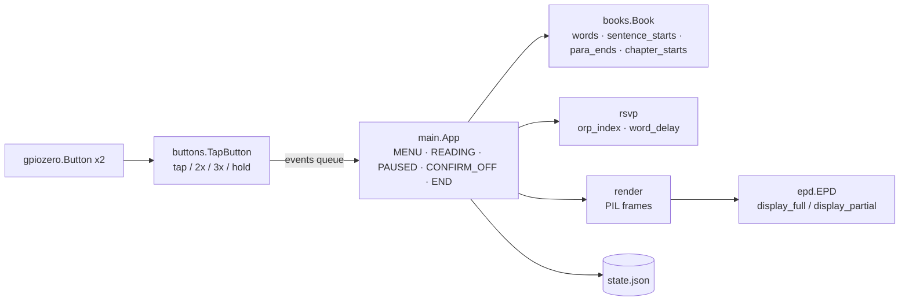

# Rapid Reader

RSVP (Rapid Serial Visual Presentation) speed reader appliance built on a
Raspberry Pi Zero W v1.1 with the Adafruit 2.13" e-Ink Bonnet (#4687,
mono, SSD1680).

Words are flashed one at a time at a fixed point. The Optimal
Recognition Point (ORP) letter is drawn bold at a fixed pivot with tick
marks above and below, so your eyes never move. Reading position and
speed are saved per book, automatically.

## Repository layout

| Path | Purpose |
|------|---------|
| `rapid_reader/` | The application (pure Python 3: stdlib + Pillow + gpiozero + spidev) |
| `rapid_reader/main.py` | Entry point: state machine, playback loop, event handling |
| `rapid_reader/rsvp.py` | ORP + per-word timing (pure functions) |
| `rapid_reader/books.py` | Library scan, `.txt`/`.epub` loading, tokenizer, chapter heuristics |
| `rapid_reader/render.py` | Every screen as a PIL image (drawing only, no hardware) |
| `rapid_reader/epd.py` | Minimal SSD1680 driver (full + fast partial refresh) |
| `rapid_reader/buttons.py` | Tap / multi-tap / hold detection on top of `gpiozero.Button` |
| `rapid_reader/config.py` | Pins, panel size, paths, timing constants |
| `system/` | systemd units + first-boot setup script installed on the device |
| `ebooks/` | Sample library (public-domain Gutenberg texts + a welcome tutorial) |
| `tests/` | Hardware-free regression tests (`pytest`) |
| `sdcard_build/` | Raspberry Pi OS Lite image used to build cards (not committed) |

See [CONTROLS.md](CONTROLS.md) for the full button reference.

## Architecture



- **Event model.** Button callbacks (gpiozero threads) only enqueue
  `(kind, n)` tuples: `("5", 2)` is a double-tap on button 5,
  `("hold5", 0)` a hold. The single main thread consumes them. While
  READING it polls the queue with `get_nowait()` between words, so a tap
  is handled within one frame.
- **Playback.** `step_word()` computes each word's delay with
  `rsvp.word_delay()` (long words and clause/sentence/paragraph ends
  linger), renders the frame, measures how long the panel took, and
  sleeps the remainder. If the panel is slower than the requested wpm it
  pulls several words into one frame so the *average* pace still
  matches.
- **Persistence.** `State` writes `state.json` atomically (tmp + rename)
  on every wpm change, every `SAVE_EVERY_WORDS` words, on pause/menu and
  on SIGTERM. `in_book` lets a power-cut mid-book resume paused at the
  same word on the next boot.
- **Hardware injection.** `App(display=..., button_cls=...)` accepts any
  object with `display_full/display_partial/sleep` and any factory with
  the `TapButton(pin, on_taps, on_hold)` signature. That is how the tests
  drive the whole app with no SPI/GPIO present; the `epd` and `gpiozero`
  imports are optional at import time.
- **Chapter detection** is best-effort: real `<h1>`–`<h6>` tags in
  EPUBs, or (plain text only) a short standalone paragraph like
  `CHAPTER I.`, `Letter 1`, `XIV` or `I. A SCANDAL IN BOHEMIA`. When the
  document has heading tags the text heuristic is *not* applied, so
  table-of-contents lines aren't mistaken for chapters.

## Controls

Two buttons, labeled **5** and **6** on the bonnet.

### Library (book list)

| Input        | Action                          |
|--------------|---------------------------------|
| 5 tap        | move selection down             |
| 5 double-tap | move selection up               |
| 6 tap        | open book (resumes last spot)   |
| 6 double-tap | rescan the ebooks folder        |
| 5 hold (1.5s)| power-off prompt (6 yes / 5 no) |

### Reading (playing)

| Input        | Action                        |
|--------------|-------------------------------|
| 6 tap        | pause                         |
| 5 tap        | back one sentence             |
| 5 double-tap | slower (−25 wpm)              |
| 6 double-tap | faster (+25 wpm)              |
| 6 triple-tap | forward one sentence          |
| 5 hold (1.5s)| save & return to the library  |

### Paused

Opening a book lands here: the current sentence with the current word
underlined, plus progress % and wpm.

| Input        | Action                        |
|--------------|-------------------------------|
| 6 tap        | resume playing                |
| 5 tap        | back one sentence             |
| 5 double-tap | previous chapter (if detected)|
| 6 double-tap | next chapter (if detected)    |
| 6 triple-tap | forward one sentence          |
| 5 hold (1.5s)| save & return to the library  |

## Adding books

Drop `.txt` or `.epub` files into `/home/reader/ebooks`:

```sh
scp "My Book.epub" reader@rapidreader.local:ebooks/
```

Then double-tap 6 in the library (or just reboot).

## Development & tests

The tests run anywhere with Python 3 + Pillow + pytest; no Pi, SPI or
GPIO is needed. DejaVu Sans must be installed (`fonts-dejavu-core` on
Debian, `ttf-dejavu` on Arch; see `FONT_DIRS` in `config.py`).

```sh
python3 -m pytest -q
```

Coverage:

- `test_rsvp.py` — ORP index rules, core-span stripping, delay weights.
- `test_books.py` — tokenizer (sentence / paragraph / chapter metadata),
  heading heuristics including the false positives they must reject,
  synthetic EPUB extraction (spine order, URL-encoded hrefs, `<h*>`
  chapters, title fallback, corrupt file), library scan, and a smoke
  test that every book in `ebooks/` loads and yields chapters.
- `test_buttons.py` — tap counting, tap-window separation, hold
  suppressing taps, gpiozero construction parameters.
- `test_render.py` — every frame is panel-sized mono; the pivot letter's
  guide ticks land exactly on `PIVOT_X`; over-long words are shrunk /
  left-aligned rather than cut; menu scrolling and progress-bar geometry.
- `test_app.py` — the state machine end to end with a fake panel: menu
  navigation, open / resume / clamp, play / pause, wpm clamp and
  persistence, sentence and chapter jumps, multi-word chunking when the
  panel is slow, periodic saves, end-of-book, resume after power-cut,
  power-off confirm / cancel, button → queue plumbing.

## Device layout

- App: `/opt/rapid-reader` (`main.py`, runs as the `rapid-reader`
  systemd service as user `reader`, groups `spi gpio`)
- Books: `/home/reader/ebooks`
- State (positions, wpm): `/var/lib/rapid-reader/state.json`
- First boot: `rapid-reader-setup.service` runs `firstboot.sh`. Local
  setup (groups, sudoers lockdown, persistent journal) never needs the
  network; the one-time apt install of `python3-pil python3-spidev
  python3-gpiozero python3-lgpio fonts-dejavu-core` does, and is retried
  on every boot until it succeeds.

## Notes & troubleshooting

- **First boot takes several minutes** (filesystem expansion, package
  install). The screen stays blank until setup finishes.
- **Refresh speed**: RSVP frames use the SSD1680 fast partial refresh
  (~0.3–0.5 s). When the requested wpm is faster than the panel can
  refresh, the reader automatically shows 2+ words per frame so the
  *average* pace still matches the requested wpm. Each word keeps its
  own bold ORP pivot letter as long as the whole chunk fits on one line
  without cutting a word off; otherwise it falls back to plain text. A
  full (flashing) refresh runs every 60 partials to clear ghosting.
- **Upside-down display**: set `ROTATE_180 = True` in
  `/opt/rapid-reader/config.py` and `sudo systemctl restart rapid-reader`.
- **Logs**: `journalctl -u rapid-reader -u rapid-reader-setup`.
- **SSH**: `ssh reader@rapidreader.local` (password set during flashing;
  WiFi is 2.4 GHz only on the Zero W).
